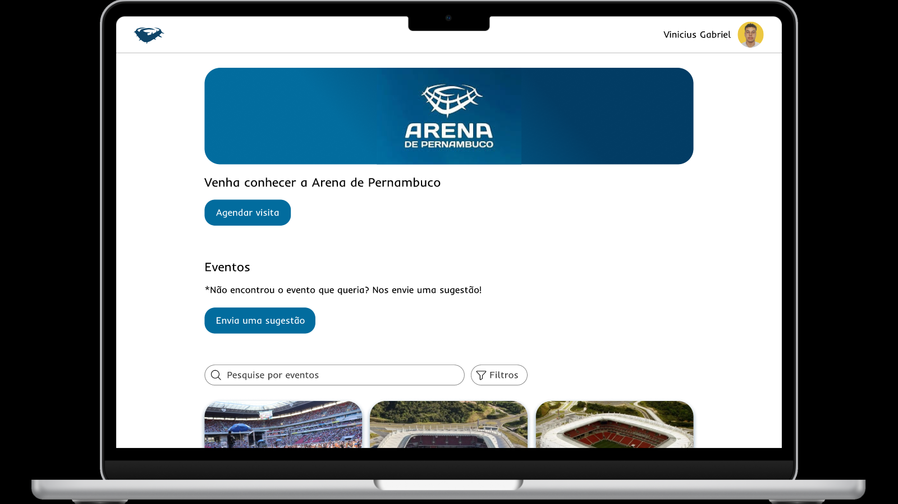

# ArenaConecta




<br/>
O ArenaConecta é uma aplicação web desenvolvida para aproximar cidadãos, organizadores de eventos e administradores da Arena de Pernambuco. A plataforma centraliza a divulgação de eventos, facilita a descoberta de atividades culturais, esportivas e corporativas, e oferece ferramentas de gestão para a administração do espaço.

Por meio de visualização de eventos, sugestões da comunidade, agendamento de visitas e um dashboard com dados estatísticos de utilização da arena, o sistema busca aumentar o engajamento da população e otimizar o uso de um importante equipamento público, contribuindo para o desenvolvimento de uma cidade mais conectada e inteligente.

# Entrega 1

7 Histórias de Usuário definidas - [Histórias](https://docs.google.com/document/d/1KWlPidcQ92aUug70fZkmI_qkIZW4cUPOScy_DsjK9yk/edit?usp=sharing)

Protótipo de Lo-Fi com 5 histórias definidas - [Figma - ArenaConecta](https://www.figma.com/design/ByptxHRdrb732CSxq2tfYd/POO?node-id=0-1&t=kt371WjXbgAD5Phl-1)

Screencast do protótipo - [ArenaConecta](https://youtu.be/0MDmpcT7xBk)
<br/>

## Organização e Gereciamento do Projeto 
📌 **Link do Quadro:** [Trello](https://trello.com/b/bcmORomh/projeto-poo)

## Como Executar o Projeto

### Pré-requisitos
- [Docker](https://docs.docker.com/get-docker/)
- [Docker Compose](https://docs.docker.com/compose/install/)

### Execução com Docker

Para facilitar o provisionamento do ambiente, o projeto utiliza Docker e Docker Compose. Siga os passos abaixo:

1. Na raiz do projeto, execute o comando:
   ```bash
   docker-compose up --build
   ```

2. Após o build e a inicialização dos containers, a aplicação estará disponível em:
   `http://localhost:8080`

3. Para encerrar a execução:
   ```bash
   docker-compose down
   ```

### Persistência de Dados
O projeto utiliza um banco de dados H2. No Docker, os dados são persistidos em um volume chamado `app-data`, garantindo que as informações não sejam perdidas ao reiniciar os containers.

